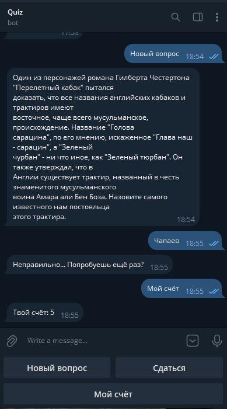
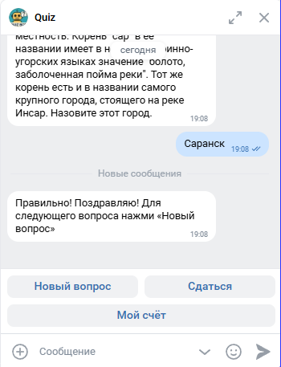

# QuizBot


## Описание
QuizBot - это набор из двух скриптов на Python для управления чат-ботами викторины в [Телеграм](https://telegram.org) и [Вконтакте](https://vk.ru).

Состоит из двух скриптов:
- quiz_tg_bot ([Ссылка на пример рабочего бота](https://t.me/QuizBot_BotBot))
- quiz_vk_bot ([Ссылка на пример рабочего бота](https://vk.ru/club233068100))

## Установка
1. В папке проекта создайте виртуальное окружение:
    ```
    python -3.10 -m venv venv
    ```
2. Установите зависимости:
    ```bash
    pip install -r requirements.txt
    ```
#### Настройка Redis
3. Создайте базу Redis (облачную или локальную):
    - Если используете облачный сервис (например, [Redis Cloud](https://redis.com/try-free/) или [Upstash](https://upstash.com/)):
        - Зарегистрируйтесь и создайте новый Redis-кластер
        - В настройках подключения получите параметры: `HOST`, `PORT`, `PASSWORD`
    - Если используете локальный Redis на сервере:
        - Установите Redis:
          ```
          sudo apt update && sudo apt install -y redis-server
          ```
        - Проверьте, что Redis работает:
          ```
          systemctl status redis-server
          ```
        - По умолчанию Redis слушает localhost:6379, DB=0, без пароля

          Чтобы включить пароль:
            - Откройте конфиг:
            ```
            sudo nano /etc/redis/redis.conf
            ```
            - Найдите строку:
            ```
            # requirepass foobared
            ```
            - Раскомментируйте и задайте свой пароль, например:
            ```
            requirepass myStrongRedisPass
            ```
            - Перезапустите сервис:
            ```
            sudo systemctl restart redis-server
            ```
4. Получите параметры подключения:
    - `REDIS_HOST` - адрес сервера Redis (например, `redis-12345.c1.us-east1-2.gce.cloud.redislabs.com` или `127.0.0.1` при локальной установке)
    - `REDIS_PORT` - порт подключения (обычно `6379`, либо указанный в облаке)
    - `REDIS_DB` - номер базы данных (по умолчанию `0`, но можно использовать другие, если нужно разделить данные)
    - `REDIS_PASSWORD` - пароль для подключения (если в облаке или если вы настроили `requirepass` локально)

        ⚠️ Если пароль не используется, оставьте поле пустым
5. Полученные параметры необходимо [сохранить в `.env`](#настройка-env)

#### Создание и настройка телеграм-бота
6. Создайте телеграм-бота и получите его токен:
    - Откройте Telegram и найдите бота по имени: `@BotFather`
    - Напишите ему команду `/start` (если ранее не общались)
    - Отправьте `/newbot` для создания нового бота
    - BotFather попросит ввести имя бота:
        - Пример: `Quiz Bot`
    - Затем попросит ввести юзернейм бота (должен заканчиваться на `bot`):
        - Пример: `QuizBot`
    - После успешного создания BotFather вернёт вам токен вашего бота. Он будет в формате:
        - `123456789:ABC-DEF1234ghIkl-zyx57W2v1u123ew11`
        - Этот токен необходимо [сохранить в `.env`](#настройка-env)
7. Получите свой `chat_id`:
    - Отправьте любое сообщение боту `@userinfobot` в Телеграм
    - В ответном сообщении будет ваш `chat_id` в формате:
        - `123456789`
        - Этот id необходимо [сохранить в `.env`](#настройка-env)
#### Создание и настройка бота во ВКонтакте (VK API)
8. Создайте сообщество:
    - Перейдите на [страницу создания сообщества](https://vk.com/groups_create)
    - Выберите тип `Публичная страница` или `Бизнес` - подойдёт любой (лучше 'Бизнес')
    - Укажите:
      - Название (например, `Quiz Bot`)
      - Тематику - любая подходящая
9. Включите бота в сообществе:
    - Перейдите в настройки сообщества:
      - [Управление → Сообщения](https://vk.com/clubXXXXXXX?act=messages) (замените XXXXXXX в ссылке на ID вашего сообщества)
    - Включите:
      - `Сообщения сообщества` - Включены
      - `Бот` - Включён
      - `API для ботов` - Включено
    - Перейдите в [Настройки → Работа с API → Long Poll API](https://vk.com/clubXXXXXXX?act=api&section=longpoll) (замените XXXXXXX в ссылке на ID вашего сообщества)
      - Включите `Long Poll API`
      - Выберите версию API (например, 5.199)
      - В разделе `Типы событий` включите хотя бы `Входящие сообщения` (message_new)
10. Создайте токен доступа:
    - Перейдите в [Настройки → Работа с API → Ключи доступа](https://vk.com/clubXXXXXXX?act=api&section=access) (замените XXXXXXX в ссылке на ID вашего сообщества)
    - Нажмите `Создать ключ`
    - В появившемся окне выберите права:
      - Сообщения
      - Управление сообществом
    - Нажмите `Создать`
    - Скопируйте полученный токен - он нужен для [настройки `.env`](#настройка-env)

#### Настройка `.env`
11. Создайте и настройте файл `.env`:
    ```env
    TG_BOT_TOKEN=1234567890:QWEtryhdj_Fjdfyeu...  # Токен телеграм-бота
    VK_BOT_TOKEN=vk1.a.LKJDGOIJHGERKGHSLIKRGQ...  # Токен ВК-бота

    REDIS_HOST=redis-....redns.redis-cloud.com    # Адрес сервера Redis
    REDIS_PORT=11111                              # Порт подключения
    REDIS_DB=0                                    # Номер базы данных (по умолчанию 0)
    REDIS_PASSWORD=5b000000000...V                # Пароль для подключения к Redis 
    
    QUIZ_FILE=quiz-questions/1vs1201.txt          # Путь к файлу с вопросами
    ENCODING=koi8-r                               # Его кодировка
    ```

## Запуск
1. Запустите телеграм-бота:
    ```bash
    python quiz_tg_bot.py
    ```
2. Запустите ВК-бота:
    ```bash
    python quiz_vk_bot.py
    ```

## Пример работы
1. Интерфейс телеграм-бота:



2. Интерфейс ВК-бота:


--------------------------------------------
--------------------------------------------


## Цели проекта

Код написан в учебных целях - для курса по Python и веб-разработке на сайте [Devman](https://dvmn.org).